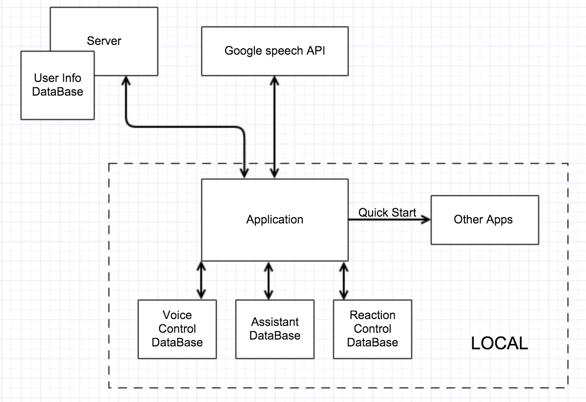
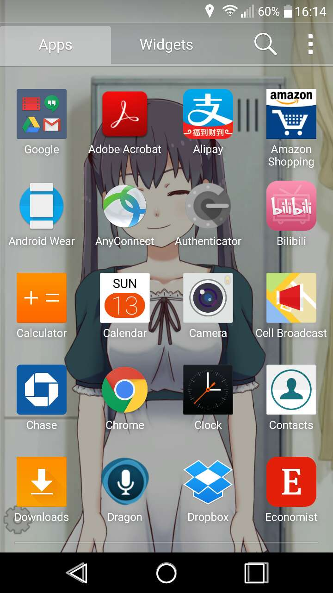
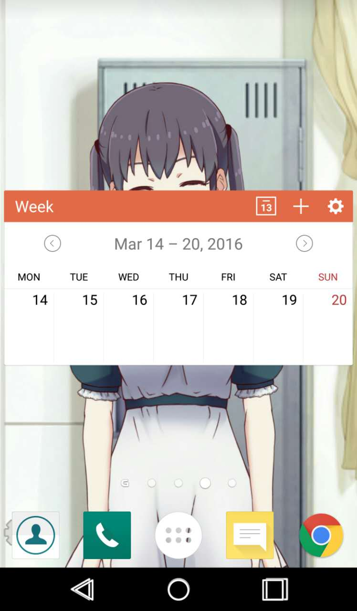
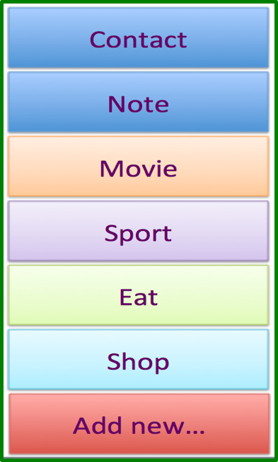
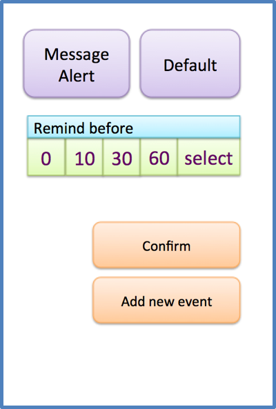

***
 # Lively Launcher <br> Initial Design Document
  Authors: Bo Wang(N12181444); Jun Li(N19907414); Miao-Ju Wei(N18701141)  
  Date: 03/12/2016  
  Version: 1.0  
***

 ## Catalog
 * **<a href="#Introduction">Introduction</a>**
 * **<a href="#RelatedWork">Related Work</a>**
 * **<a href="#Solutions">Solutions</a>**
  * <a href="#ArchitectureDiagram">Architecture Diagram</a>
  * <a href="#Framework">MVC Framework</a>
  * <a href="#UIDesign">UI Design</a>
  * <a href="#UseCase">Use Case</a>
  * <a href="#OtherComponents">Other Components</a>
 * **<a href = "#ProjectMemberBreakdowns">Project Member Breakdowns</a> **
 * **<a href = "#Goals">Goals for each Milestone</a> **


 <span id = "Introduction"/>  
 ### **Introduction**

 Nowadays, mobile devices are widely used and become a very important part of people's lives. It is very common in daily lives that people use cell phone for waking themselves up in the morning, making schedules with assistant applications, keeping in touch with others by social media apps, navigating with the Google Map, booking restaurants and hotels, etc. Almost everybody has at least one cell phone and stays with it 24 hours a day. So, it is quite reasonable to make the cell phone as a personal assistant to help us manage our daily lives. Also, we think it would have more fun for many users if we give the cell phone an image and make it more interactive. These are the basic ideas of our project.

 One common problem of assistant-like applications is that it takes time for users to find the right app, press the icon, open the app, and start to schedule. It would be inconvenient when users want to finish schedules in a short time. Another problem is that many to-do list applications don't understand the schedules well and have no category of events. So users have to take more steps to finish a schedule. For example, a user plans to call someone else at a certain time, but he/she has to make the call manually after getting the notification from the assistant application. Moreover, it always has to involve other people in your schedule. So when arranging schedule, you also have to mark down when to contact or invite your family, friends, colleagues, etc. in your calendar. Such a tiresome task makes people miss something easily. Even people can record everything concisely in their calendar, it always takes time to schedule because you have to finish your scheduling at separate interfaces.

 *Lively Launcher* is a home screen launcher with voice control and assistant functionalities. Comparing with traditional launchers, it is more interactive and fun to use.  It also boosts the assistant functionalities, making it easier to set up a schedule and offering a better service to users.


<span id = "RelatedWork"/>
 ### **Related Work**  
 There are a lot of calendar and note taking APPs in the market. Some of they focus on the fancy note taking interface or functional but sometime more complicated operation such as ToDo-List(https://todoist.com/sony). Users sometimes have to spend too much time to set up the schedule. Other of them are simple and only leave the text field for user to written down what they are going to do such as Google Keep. It is convenient, but problem is that for the most case, a schedule is more than a line of test and involving others, users have to many other things after simply arrange a schedule in this kind of apps.  
 Also there are some applications provide voice control and even give an image to the applications, such as Dragon(http://www.dragonmobileapps.com/android/). Though it gives an image to  the application, the there isn't any visible interactions with user. It is highly relied on its voice recognized technology. But online recognizing sometimes is slow, and many users actually do not use voice control in a complex way.  
 Most users want is using digital assistant in a efficient and interesting way. We try simplify the steps and make scheduling as easy as possible, even for someone who are only aware of simple cell phone application. We integrate all basic but useful requirements together. Also we combine voice control to set up all your schedule. It acts as your really personal assistant in reality.

<span id = "Solutions"/>
 ### **Solutions**

 Home screen launcher is the first application we interact with when using a phone. It is the starting and ending place of all other applications. We can simply boost the schedule procedure by building assistant functionalities in the launcher. Meanwhile, our application makes people to arrange their schedule more easily and efficiently. Only take few steps or even just talk to your “personal assistant” to record everything. And user can choose their own way to remind them the arriving event. The launcher enhances the interaction by using Live2D technology. When users open their cell phone, what they face is their "personal assistant" in 2D flavor instead of static icons. The model is based on 2D not 3D, so it will be nicer and saves more battery life. The model will response to users' actions like touching and voice.

 <span id = "ArchitectureDiagram"/>
 ##### Architecture Diagram  
  The initial architecture is like following.

    

  We are going to use Google API to achieve voice control ability. On local side, the application will have three different kinds of databases for voice control, reaction control, and assistant. They may be merged into one database schema in real development. The application also have the ability to start other applications in the phone. On server side, the server we are going to collect user information, so we can provide better service in the future. And it is good for backup when user changes a cell phone.  

 <span id = "Framework"/>
 ##### MVC Framework  
 ##### model
 For assistant functionalities, we have following models:
 * Event  
   This model is for each single schedule. It should have an ID to separate it from other events. It should contain a list of persons that may involve in this event in the future. So application can send a invitation to the people based on the list. It also should have a type to define the action user going to take. So application will have different behaviors based on the type.
   ```java
   class Event implement Parcelable{
     long eventId; // id for each event
     DateParcel date; // parcelable date
     String note; // note content
     Boolean remindType; // alert message or not
     long remindBefore; // the time to remind before event occurs
     List<Person> persons; // list of contact person
   }
   ```
 * Person   
   This model presents the person invited by user. It comes from the contact list. It should implement parcelable interface.
   ```java
   class Person implement Parcelable{
      long personId; // id for each person
      String name;
      String phoneNumber;
      String email;
   }
   ```
 * Type  
   This model defines what kind of action user going to take, such as movie, shop, sport, etc.
   ```java
   class Type implement Parcelable{
      long typeId;
      String name; // type name
   }
   ```
 * DataParcel  
   A helper to package Date class.
   ```java
   class DataParcel implement Parcelable{
      Date date; // date
   }
   ```  


 For launcher, we are going to predefine some reactions such as smiling, nodding, etc. Each model presents a reaction of "assistant" shown on the screen to a certain action from user.
 * Nodding
 ```java
 class nodding{
   Live2DModel model;
   // drawing functions
 }
 ```


   ##### controller
   *Launcher:* This class is the entry of entire application. It contains at least 3 fragments, one for drawing the image, one for showing all existing applications in the cell phone, and one provide a calendar for using to choose and intent to activity for schedules. It also will provide a search function for use to find the application quickly.  
   *VoiceUtility:* This class provide a service of voice control. It contains following functions:
  * translateVoice: This method translates voice to string and return this string by using RecognizerIntent.  
  * parseString: This method parses the string translated from voice, determining what type of things user wants to do such as creating an event or making a call, etc. It saves the content to a private instance variable and returns the type.
  * handleCreateEvent: This method gets an Event Object as an argument and save the event to database.
  * handleCall: This method gets an String as an argument and call this string.
  * handleSendText: This method gets 2 Strings as arguments, one of which is the phone number and another is the content of text. Return true if send successfully or false if not.
  * handleCheckWeatherInformation: This method returns some information about weather, using google location service to determine user’s location and return the weather information by a 3rd party library.
  * handleCheckSchedule: This method returns an List of Event Objects.
  * handleOpenApp: This method gets an String as argument and open the app that the String denotes.  


  *ChooseType:* This class is to choose the action type user going to take. It will pass the result to *Schedule* class.  
  *Schedule:* This class is to set up a schedule. User need to choose the date, reminding type, involving person, etc. There will be some different based on the action type user chose before.  
  *Notification:* The class is to pop up a notification when time is come. It will show on the notification bar.


 <span id = "UIDesign"/>
 ##### UI Design
  Here are some simple drawings to describe the UI we are going to build.  

 * This is the basic UI of the launcher. Different from traditional launcher, there is no application icons on the screen. The person shown on the screen will have response to users actions. User can quickly start an application or editing a schedule by voice control.   
  

 * There is a place for user to view and manage all applications in the phone. The application icons will be well sorted. And There will be a row to show the most frequently used applications, so user can manually start the applications quickly.  
    

 * When we start to make a schedule. The launcher will show a calendar for user to pick up a date.  
    

 * We also have a good category of actions. So user can simply click the things they are going to do. And application will lead user to finish the schedule without additional tiresome steps.    
   --->
    

<span id = "UseCase"/>
 ##### Use Case
 As a launcher, it has two layers, the first one is for the Live2D Model, the second one for basic launcher functions. In the first layer, when user touch the screen, the Live2D Model's eye will follow the user's finger. when user touch the model, it will smiling. When user finish a schedule and return back to the launcher, it will nodding. In the second layer, it will support basic functions such as showing all the existing applications, showing 5 the most frequently used applications, searching applications in search bar.  
 For assistant functionalities, When making personal scheduling, user can arrange all other related event at one time. For example, people may want to schedule at a specific time range to give a phone call or text to someone. In this case, user can select the “contact” category, choose the contact person from their contact list, and then just set when to invoke the reminder. Upon the reminding time, it will trigger the alert message where user can dial the contact person right away.  
 In your schedule, you may want to book a time to have some sports, but you may want to involve some of your friends to your activity. In this situation, you can select at the activity category, choose the friend you want to invite from your contact list, then you can invite your friend when making your schedule.   
 Sometimes you may want to schedule a time to watch movies. If you select the movie category, after you finish your scheduling you can go to the movie website directly in you calendar. You do not have to go back to your web browser each time. You can check related information in your calendar.  
 When using voice control:

| Process    | Result     |
| :------------- | :------------- |
| [Create an event by voice] Main View -> user holds the button and says like “Create a event” -> AI responses “When will your event begin?” -> user says “Three PM” -> AI responses “OK. when will it end?” -> user says “Five PM” -> AI responses “OK. What is your event about?” -> user says “Watch movie”-> AI responses “OK. Where will you go for a movie?” -> user says “Times Square.” -> AI responses “Got it. Who will go with you?” -> user says “Tom and Lily.” -> AI responses “OK. So you want to create an event that watch a movie from Three PM to Five PM with Tom and Lily at Times Square. Is this right?” -> user can say “Yes.” to confirm if there is nothing wrong, or “No.” to remind AI that something is wrong. User says “No.” -> AI response “So what information do you want to revise? Location, time or something else?” -> user can say “Location.” or something like that. -> AI response “OK. Where will you go for a movie?” -> … -> “When do you want me to remind you?” -> … -> Until finished.| Create an event.|
|[Create an event by voice] Main View -> user holds the button and says like “Create a event that go to the Sunset Park at three PM with Tom and Lily” -> AI response “OK. You want to create an event that go to the Sunset Park at Three PM with Tom and Lily. Is that right?” -> user can revise like above or just says “Yes.” if everything is correct. -> AI responses “When do you want me to remind you?” -> …-> Until finished. |Create an event.|
|[make a call] Main View -> user holds the button and says “Call Tom.” -> AI responses “I found Tom in your contact book, do you want to make a call to Tom now?” -> user says “Yes.” -> Make a call.|Make a call.|
|[make a call] Main View -> user holds the button and says “Call 1234567890” -> AI responses “Do you want to make a call to 1234567890 now?” -> user says “Yes.” -> Make a call.|Make a call.|
|[send a message] Main View -> user holds the button and says “Send a message to Tom that I will arrive at three PM.” -> AI response “OK. I found Tom in your contact book and here is what you want to send: ‘I will arrive at three PM’. Is that right?” -> user responses “Yes.” -> message sent.|Send a message.|
|[open an app] Main View -> user holds the button and says “Open music.” -> Open music if found this app. If not found, AI response “App not found.”|Open an app.|
|[check the schedule] Main View -> user holds the button and says “Check my schedule” -> AI responses with a calendar “You have one event today: watch movie with Tom and Lily at three PM at Times Square. I will remind you one hour before that begins.”|Check the schedule.|
|[weather information] Main View -> user holds the button and says “How’s the weather today?” -> AI responses “It’s going to be sunny today, 57 degree to 70 degree, good temperature for outside activities!”|Weather information.|
|......|......|


<span id = "OtherComponents"/>
 ##### Other Components  
 All database operations will be put into DAO a package. The temporary schema is shown as *model* part in this document. The third party library we are going to use is Google speech API (https://www.google.com/intl/en/chrome/demos/speech.html) and Live2D (http://www.live2d.com/en/).  

<span id="ProjectMemberBreakdowns"/>
  ### **Project Member Breakdowns**
  Bo Wang: launcher implementation<br/>
  Jun Li: voice control<br/>
  Miao-Ju Wei: assistant functionalities  


<span id="Goals"/>
  ### **Goals for each Milestone**  
  * 03/28/2016 - The project temporary divide into three parts. Each part should have a prototype, at least running well separately. We should figure out what else we need which is missed in initial design document and have a more precise breakdowns.
  * 04/18/2016 - In-class Demo. Each part of application can running as whole well. Some details needs to improve. Start to improve UI.
  * 04/30/2016 - Application runs well as a whole. Prepare for documents.
  * 05/09/2016 - Poster Presentation.
  * 05/16/2016 - Final Design documents Due.
